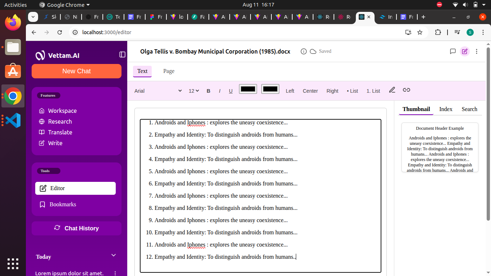

# 📄 Vettam.AI Document Editor

A modern multi-page document editor built with **React** + **TipTap**, designed for professional document creation, AI-assisted writing, and export-ready formatting.  

---

## ✨ Features

- **Multi-Page Support**  
  Automatically splits content into multiple pages (900 characters per page) with dynamic pagination.

- **Text Editing Tools**  
  Bold, italic, underline, fonts, font sizes, links, and images.

- **Drawing & Highlighting**  
  Built-in draw mode and highlight tools for annotations.

- **Header & Footer Control**  
  Editable headers and footers that survive export/print.

- **Thumbnails Preview**  
  Navigate quickly between pages with a right-side preview panel.

- **"Ask Vettam" AI Assistant**  
  Input box for AI-powered suggestions and answers.

- **Auto-Save Status**  
  Displays real-time save status (`Saved` / `Saving...`).

---

## 🛠 Tech Stack

| Category       | Technology |
|----------------|------------|
| Frontend       | React 18, TypeScript |
| Editor         | TipTap (StarterKit, Placeholder, Image, Link, Highlight, FontFamily) |
| Icons          | React Icons (Feather Icons) |
| Styling        | CSS Modules / Custom CSS/ Tailwind Css |
| State Handling | React Hooks (useState, useEffect) |

---

## 📦 Installation

1️⃣ **Clone the repository**
```bash
git clone https://github.com/yourusername/vettam-editor.git
cd vettam-editor
npm install
npm run start

1️⃣ ** working directory**
master

## 📸 Screenshots



